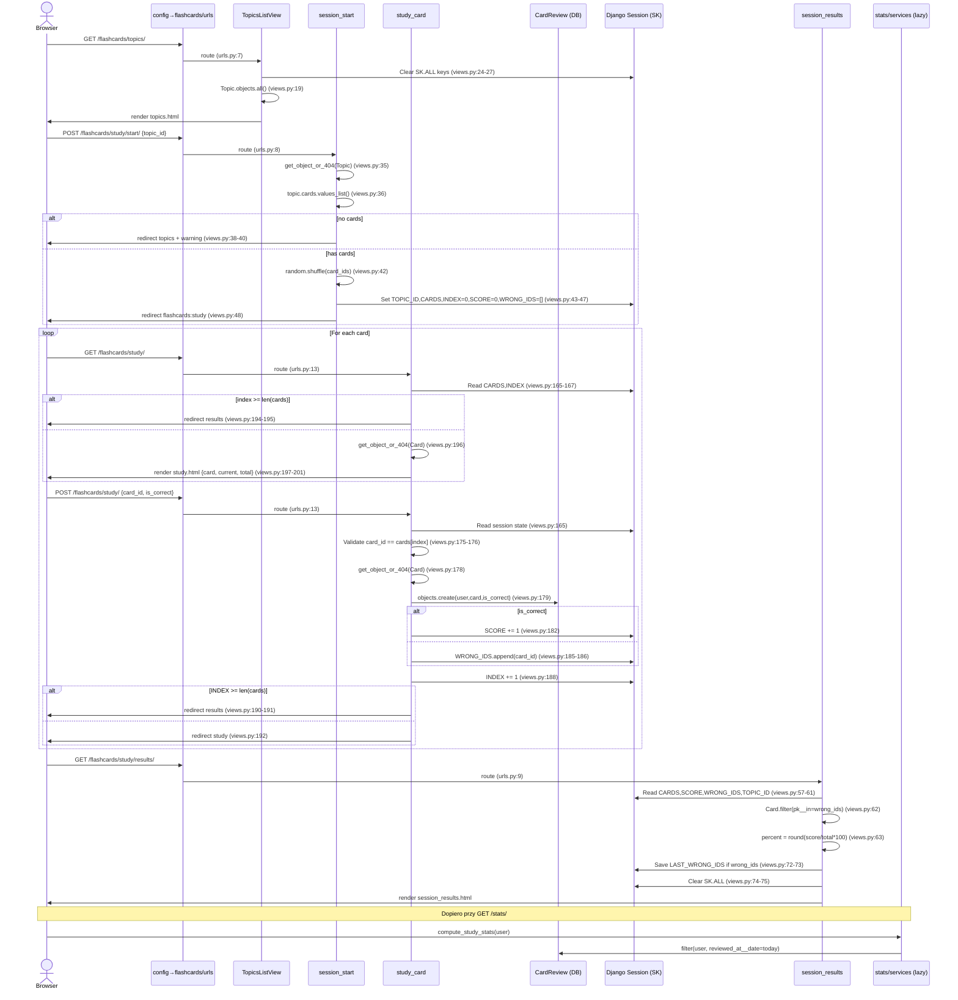

co jeszcze brakuje z modułu 4---
date: 2026-06-25T18:16:32+02:00
researcher: Claude Sonnet 4.6
git_commit: cdcf0b4cf92cd6e734ee581b40063573b0a7e499
branch: master
repository: naukaAI
topic: "Analiza przepływu complete-study-session — E2E trace, luki testów, blast radius"
tags: [research, session-flow, flashcards, django-session, blast-radius, test-gaps, verified]
status: complete
last_updated: 2026-06-25
last_updated_by: Claude Sonnet 4.6
last_updated_note: "m4l4-3 weryfikacja twierdzeń strukturalnych (ast-grep + grep) — 3 korekty inline, dodano sekcję Weryfikacja twierdzeń"
verification_commit: cdcf0b4
---

# Research: Analiza przepływu complete-study-session

**Date**: 2026-06-25T18:16:32+02:00
**Git Commit**: `cdcf0b4cf92cd6e734ee581b40063573b0a7e499`
**Branch**: master
**Repository**: naukaAI

## Research Question

Przeanalizuj przepływ complete-study-session, zwracając szczególną uwagę na obszary zdefiniowane w `context/map/repo-map.md`. Trzej równolegli sub-agenci: (1) Trace E2E z file:line i Mermaid, (2) Luki w testach, (3) Blast radius z grafem statycznym i git co-change.

---

## Feature Overview

**Przepływ:** Użytkownik wybiera temat → przechodzi przez wszystkie karty (shuffle, PRG pattern) → widzi wynik. Stan w całości w Django session dict pod 5 kluczami SK.

**Entry points (evidence — config/urls.py:53, flashcards/urls.py:7-13):**
```
GET  /flashcards/topics/         → TopicsListView    (views.py:18)
POST /flashcards/study/start/    → session_start     (views.py:30)
GET  /flashcards/study/          → study_card        (views.py:159)
POST /flashcards/study/          → study_card        (views.py:159)
GET  /flashcards/study/results/  → session_results   (views.py:52)
GET  /flashcards/study/review/   → study_review      (views.py:139)  ← dodano (ast-grep)
```

**Jedyny produkcyjny zapis do DB w przepływie HTTP:**
```python
# flashcards/views.py:179
CardReview.objects.create(user=request.user, card=card, is_correct=is_correct)
```
Zapisywane pola: `user_id`, `card_id`, `is_correct` (bool), `reviewed_at` (default=timezone.now).

> **Doprecyzowanie (ast-grep):** Łącznie w repo `CardReview.objects.create` ma 9 call-site'ów: views.py:179 (jedyny HTTP), `management/commands/verify_manual_checks.py:66-68,104,134` (5 wywołań w management command), `stats/tests.py:20-24` (_add_review wrapper), `stats/tests.py:126,176` (bezpośrednie w testach).

**stats NIE są wywoływane automatycznie** — `compute_study_stats()` uruchamia się dopiero gdy użytkownik odwiedzi `/stats/` (lazy evaluation, evidence: brak importu stats w flashcards/views.py).

### Diagram E2E (sequenceDiagram)



### Guard clauses (evidence — file:line)

| Widok | Guard | Lokalizacja | Zachowanie |
|-------|-------|-------------|------------|
| `TopicsListView` | LoginRequired | views.py:18 | redirect /accounts/login/ |
| `TopicsListView` | Clear stale session | views.py:24-27 | `SK.ALL` pop z sesji |
| `session_start` | Method=POST only | views.py:32-33 | `HttpResponseNotAllowed(['POST'])` |
| `session_start` | Topic exists | views.py:35 | `get_object_or_404(Topic)` → 404 |
| `session_start` | Topic has cards | views.py:38-40 | redirect topics + messages.warning |
| `study_card` | Session complete | views.py:161-163 | redirect topics |
| `study_card` | Valid card_id int | views.py:170-174 | `ValueError` → logging.warning, redirect study |
| `study_card` | card_id == cards[index] | views.py:175-176 | redirect study, no DB write |
| `study_card` | Card exists in DB | views.py:178 | `get_object_or_404(Card)` → 404 |
| `study_card` GET | index in bounds | views.py:194-195 | redirect results |
| `study_card` POST | end of session | views.py:190-191 | redirect results |
| `session_results` | Session complete | views.py:53-55 | redirect topics |
| `session_results` | division safety | views.py:63 | `if total else 0` |
| `study_review` | `@login_required` | views.py:139 | redirect /accounts/login/ ← dodano (ast-grep) |
| `study_review` | Read LAST_WRONG_IDS | views.py:144 | `.pop()` cross-session handoff |
| `study_review` | Init SK for review | views.py:151-155 | TOPIC_ID=None, CARDS=wrong_ids, INDEX=0, SCORE=0, WRONG_IDS=[] |

### SK.LAST_WRONG_IDS — cross-session handoff

`SK.LAST_WRONG_IDS` (`"last_wrong_ids"`) to celowy "most" między session_results a study_review:
- Zapisany przez `session_results` (views.py:72-73) przed czyszczeniem SK.ALL
- Odczytany (`.pop()`) przez `study_review` (views.py:144) przy inicjalizacji sesji review
- NIE należy do `SK.ALL` — nie jest czyszczony przez `TopicsListView`
- Inference: umożliwia "Study missed cards" bez ponownej selekcji tematu

---

## Technical Debt

### TD-1: God View — `flashcards/views.py` (201 linii, 7 klas, 10 funkcji)

**Evidence:** views.py = 201 linii, 13 importów, 16 (raport: 15) commitów (artifact-1). Cała logika: CRUD kart, logika sesji, spaced repetition review, guard clauses — w jednym pliku.

**Ryzyko:** Każda nowa feature ląduje tutaj. Koszt przeczytania pliku rośnie liniowo; test isolation niemożliwa bez pełnego Django stack.

**Źródło:** repo-map.md (strefa ryzyka #1) + artifact-2 (God View, layer violation).

---

### TD-2: Luki w pokryciu testów (~40% gałęzi niepokrytych)

**Evidence:** 10 gałęzi niezatestowanych (raport agent 2):

| Priorytet | Gałąź | Ryzyko |
|-----------|-------|--------|
| HIGH | LoginRequired (5 widoków) | Regression `@login_required` niewychwycony |
| MEDIUM | GET /study/start/ → 405 | `HttpResponseNotAllowed` niepotwierdzony |
| MEDIUM | topic_id=invalid → 404 | `get_object_or_404(Topic)` niezatestowany |
| MEDIUM | card_id=404 → 404 | `get_object_or_404(Card)` niezatestowany |
| LOW | invalid card_id (non-int) | ValueError catch + redirect niezweryfikowany |
| LOW | percent=0 edge case | `if total else 0` guard niezatestowany |

**Dobrze pokryte (evidence):** happy path, score accuracy (tests.py:309-327), cross-card injection guard (tests.py:345-357), partial session redirect (tests.py:359-391), LAST_WRONG_IDS review flow (tests.py:267-290).

---

### TD-3: Ukryty blast radius `stats → flashcards.CardReview`

**Evidence:** `stats/services.py` bezpośrednio czyta pola `CardReview`:
- `user` — services.py:22,32,59
- `reviewed_at` — services.py:22,33,34,59 (raport: 22,32,59)
- `is_correct` — services.py:15,26 (raport: 27)
- `related_name='card_reviews'` — services.py:15 (`Count('card_reviews', ...)`)

**Ryzyko:** Zmiana schematu `CardReview` (np. `is_correct` → `score: int`) łamie `stats/services.py` i wszystkie testy `LeaderboardViewTests` (tworzy `CardReview` bezpośrednio, tests.py:126,176) bez sygnału typecheckera ani lintingu.

**Źródło:** artifact-2 (jedyne cross-app sprzężenie), repo-map.md (strefa ryzyka #2).

---

### TD-4: Brak testów własnych `flashcards/session.py`

**Evidence:** session.py — 1 commit (`bcc: 2026-06-14`), brak bezpośrednich testów jednostkowych dla klasy `SK` i `get_session()`.

**Ryzyko:** Kontrakt 5 kluczy sesji współdzielony przez **4 widoki** (`session_start:43-47`, `session_results:57,72-73`, `study_review:151-155`, `study_card:165,182,188`). Literówka w wartości stringa w SK = cichy `KeyError` w runtime — testy integracyjne wychwycą to dopiero przy pełnym request cycle.

> **Korekta (ast-grep):** Pierwotny raport wymieniał 3 widoki — pominięto `study_review` (views.py:151-155), który resetuje SK do nowej sesji review (TOPIC_ID=None, CARDS=wrong_ids, INDEX=0, SCORE=0, WRONG_IDS=[]).

**Źródło:** artifact-3 (najsłabiej udokumentowany obszar), repo-map.md (strefa ryzyka #3).

---

### TD-5: Logika biznesowa w `config/urls.py`

**Evidence:** `config/urls.py:34` (RegisterView.form_valid → redirect topics), `config/urls.py:42` (HomeView.dispatch → redirect topics).

**Ryzyko:** Zmiana flow auth (np. dodanie ekranu onboarding po rejestracji) wymaga edycji pliku konfiguracyjnego zamiast widoku.

**Źródło:** artifact-2 (layer violation), repo-map.md (strefa ryzyka #4).

---

## Blast Radius — pełna mapa

### Co zmienia się razem (14 komponentów)

| Komponent | Trigger zmiany | Evidence / Inference |
|-----------|---------------|----------------------|
| `flashcards/views.py` | Każda zmiana logiki sesji | Evidence: 16 commitów |
| `flashcards/tests.py` | Zawsze razem z views.py | Evidence: 13 commitów, historyczne co-change |
| `flashcards/urls.py` | Nowy/usunięty endpoint | Evidence: 8 commitów |
| `flashcards/session.py` | Nowy klucz SK | Evidence: oddzielny commit refaktoru |
| `flashcards/templates/flashcards/study.html` | Zmiana kontraktu `card`, `current`, `total` | Evidence: render views.py:197 |
| `flashcards/templates/flashcards/session_results.html` | Zmiana kontraktu `score`, `total`, `percent`, `missed_cards`, `topic_id` | Evidence: render views.py:65 |
| `flashcards/templates/flashcards/topics.html` | Zmiana `flashcards:study_start` URL | Evidence: form action topics.html:19 |
| `templates/base.html` | Zmiana nawigacji / nowy URL nav | Evidence: 5 commitów, link base.html:199 |
| `stats/services.py` | Zmiana schematu `CardReview` | Evidence: services.py:15,22,27,32,59 |
| `stats/tests.py` | Zmiana `CardReview` schema | Evidence: `_add_review` helper (tests.py:20-24) + bezpośrednie create() tests.py:126,176 *(linia 23 w oryginale → poprawka ast-grep: 20)* |
| `stats/templates/stats/dashboard.html` | Zmiana URL `flashcards:topics` | Evidence: dashboard.html:82 |
| `config/urls.py` | Zmiana URL `flashcards:topics` | Evidence: urls.py:34,42 |
| `flashcards/migrations/` | Zmiana schematu modelu | Inference: Django ORM — makemigrations |
| `flashcards/management/commands/verify_manual_checks.py` | Zmiana URL lub HTTP kontrakt | Evidence: używa wszystkich 5 URL names |

### Warstwy generowane (tańsze sprzężenie)

`flashcards/migrations/` — 4 pliki, zmieniają się przez `makemigrations`, nie ręcznie. Relevantne dla tego przepływu: `0001_initial.py` (CardReview schema), `0002_card_cardreview_card.py` (FK card). Koszt zmiany: po stronie modelu, nie migracji.

---

## Code References

- `config/urls.py:34,42,53` — entry points + logika redirect
- `flashcards/urls.py:7-13` — 4 URL patterns sesji
- `flashcards/views.py:18-27` — TopicsListView (clear session)
- `flashcards/views.py:30-48` — session_start (shuffle + init SK)
- `flashcards/views.py:52-76` — session_results (read + clear SK + save LAST_WRONG_IDS)
- `flashcards/views.py:159-201` — study_card (GET+POST, guard clauses, CardReview.create)
- `flashcards/views.py:179` — **jedyny zapis do DB w tym przepływie**
- `flashcards/models.py:37-57` — CardReview (user, card, is_correct, reviewed_at, Meta.indexes)
- `flashcards/session.py:6-13` — SK constants + SK.ALL
- `flashcards/session.py:24-25` — get_session() → SessionState TypedDict
- `flashcards/tests.py:26-55` — test_full_session_happy_path
- `flashcards/tests.py:309-327` — test_session_score_matches_cardreview_db
- `flashcards/tests.py:345-357` — test_cross_card_post_rejected_no_db_write
- `stats/services.py:15,22,27,32,59` — CardReview fields consumed by stats

---

## Powiązanie z repo-map.md

| Strefa ryzyka (repo-map) | Potwierdzenie w research |
|--------------------------|--------------------------|
| #1 God View views.py | TD-1: 201 linii, 15 commitów |
| #2 stats→CardReview blast radius | TD-3: 4 pola, 14 konsumentów |
| #3 session.py brak testów | TD-4: 1 commit, 0 unit testów |
| #4 config/urls.py logika biznesowa | TD-5: 2 miejsca redirect |

---

## Open Questions

1. **UNKNOWN:** Czy testy Playwright (`.playwright-cli/`) pokrywają ten przepływ E2E? Nie sprawdzono zawartości katalogu.
2. **UNKNOWN:** Czy `flashcards:study_start` i `flashcards:study_results` URL names są używane w plikach Playwright lub innych testach poza `flashcards/tests.py`?
3. **INFERENCE (niezweryfikowana):** Czy `study_review` (spaced repetition) poprawnie izoluje swój SK.LAST_WRONG_IDS od nowej sesji gdy użytkownik wraca do topics i zaczyna inny temat? (SK.LAST_WRONG_IDS nie jest w SK.ALL — nie jest czyszczony przez TopicsListView).
4. **INFERENCE:** `CardReview.Meta.ordering = ['-reviewed_at']` (models.py:54) — czy stats używające `.order_by('-reviewed_at')` (services.py:32) są odczytywane poprawnie po indeksie? Wymaga sprawdzenia pod obciążeniem.

---

## Separacja dowodów

**EVIDENCE (potwierdzone file:line):** wszystkie referencje do `views.py`, `models.py`, `session.py`, `urls.py`, `tests.py`, `services.py` w tym raporcie.

**INFERENCE (logiczne wnioski):** stats lazy evaluation (brak importu = brak auto-call), SK.LAST_WRONG_IDS jako celowy cross-session handoff, blast radius migracji.

**UNKNOWN (białe plamy):** pokrycie Playwright, zachowanie LAST_WRONG_IDS przy multi-topic session switch.

---

## Weryfikacja twierdzeń (ast-grep)

> Wykonano: 2026-06-25. Narzędzia: ast-grep v0.42.3 + grep. Codebase commit: `cdcf0b4`.  
> Weryfikowano twierdzenia STRUKTURALNE z sekcji TD-1, TD-3, Feature Overview i SK.

| Twierdzenie | Werdykt | Dowód (plik:linia) | Metoda |
|-------------|---------|---------------------|--------|
| views.py ma 201 linii | **POTWIERDZONE** | `wc -l flashcards/views.py` → 201 | wc |
| views.py ma 13 importów | **POTWIERDZONE** | `grep -c "^import\|^from" views.py` → 13 | grep |
| views.py ma 16 commitów *(raport: 15)* | **DOPRECYZOWANE** | `git log --oneline -- views.py \| wc -l` → 16 | git log |
| views.py ma 7 klas | **POTWIERDZONE** | `grep -c "^class " views.py` → 7 | grep |
| views.py ma 10 funkcji/metod | **POTWIERDZONE** | `grep -n "def " views.py` → 10 wierszy (4 FBV + 6 metod klas) | grep |
| session.py ma 1 commit | **POTWIERDZONE** | `git log --oneline -- session.py \| wc -l` → 1 | git log |
| tests.py ma 13 commitów | **POTWIERDZONE** | `git log --oneline -- tests.py \| wc -l` → 13 | git log |
| SK.LAST_WRONG_IDS NIE należy do SK.ALL | **POTWIERDZONE** | session.py:11 `LAST_WRONG_IDS = "last_wrong_ids"`, session.py:12 `ALL = [TOPIC_ID, CARDS, INDEX, SCORE, WRONG_IDS]` — LAST_WRONG_IDS absent | grep |
| session_results zapisuje LAST_WRONG_IDS (views.py:72-73) | **POTWIERDZONE** | views.py:73 `request.session[SK.LAST_WRONG_IDS] = wrong_ids` | grep |
| study_review odczytuje LAST_WRONG_IDS przez .pop() (views.py:144) | **POTWIERDZONE** | views.py:144 `wrong_ids = request.session.pop(SK.LAST_WRONG_IDS, None)` | grep |
| compute_study_stats nie wywoływana z flashcards | **POTWIERDZONE** | zero wyników w flashcards/; tylko stats/views.py:12, stats/services.py:19 | grep |
| `user` — services.py:22,32,59 | **POTWIERDZONE** | grep potwierdza `user=user` w CardReview.objects.filter na liniach 22, 32, 59 | grep |
| `reviewed_at` — services.py:22,33,34,59 *(raport: 22,32,59)* | **DOPRECYZOWANE** | linia 32 nie ma reviewed_at (to `filter(user=user)`); reviewed_at na 22, 33 `.order_by('-reviewed_at')`, 34 `values_list('reviewed_at')`, 59 `.dates('reviewed_at')` | grep |
| `is_correct` — services.py:15,26 *(raport: 27)* | **OBALONE** | grep: linia 27 nie istnieje jako is_correct; faktyczne lokalizacje: 15 `Count('card_reviews', filter=Q(card_reviews__is_correct=True))`, 26 `today_qs.filter(is_correct=True)` | grep |
| `related_name='card_reviews'` — services.py:15 | **POTWIERDZONE** | services.py:15 `Count('card_reviews', filter=Q(...))` | grep |
| Jedyny produkcyjny zapis do DB w HTTP: views.py:179 | **POTWIERDZONE** | ast-grep `CardReview.objects.create` → views.py:179 jedyna lokalizacja w HTTP flow | ast-grep |
| SK zapisywane w 4 widokach *(raport oryg.: 3)* | **POTWIERDZONE** | ast-grep `request.session[$SK.$KEY]` → session_start:43-47, session_results:73, study_review:151-155, study_card:182,186,188 | ast-grep |
| @login_required na 4 widokach *(raport oryg.: 3)* | **POTWIERDZONE** | ast-grep `@login_required` → views.py:30, 51, 139, 159 | ast-grep |
| get_object_or_404 × 3 w views.py (35, 178, 196) | **POTWIERDZONE** | ast-grep → views.py:35, 178, 196 | ast-grep |

**Korekty wprowadzone inline:** "15 commitów" → "16 (raport: 15)"; `is_correct` line 27 → 15,26 (raport: 27); `reviewed_at` linie 22,32,59 → 22,33,34,59 (raport: 22,32,59).

---

## Weryfikacja ast-grep (m4l3-2)

Wykonano 2026-06-25. Narzędzie: ast-grep v0.42.3 + grep jako fallback. Każde twierdzenie strukturalne z powyższego raportu zostało skonfrontowane z wynikami parsera AST.

| # | Twierdzenie z raportu | Werdykt | Plik:linia (ast-grep) | Korekta |
|---|-----------------------|---------|----------------------|---------|
| T1 | "Jedyny zapis do DB w tym przepływie: `CardReview.objects.create` views.py:179" | **DOPRECYZOWANE** | views.py:179, management/commands/verify_manual_checks.py:66-68,104,134, stats/tests.py:20-24,126,176 | Claim prawdziwy dla HTTP flow; łącznie 9 call-site'ów w repo — verify_manual_checks.py (5) i stats/tests.py (helper + 2) były nieuwzględnione. Zmieniono nagłówek sekcji na "Jedyny produkcyjny zapis do DB w przepływie HTTP". |
| T2 | "Jedyne cross-app sprzężenie: `stats/services.py → flashcards.models.CardReview`" | **DOPRECYZOWANE** | stats/services.py:7, stats/tests.py:7 | Dwa pliki importują z flashcards.models, nie jeden. stats/tests.py:7 importuje CardReview bezpośrednio (poza serwisem). Blast radius sekcja wspominała tests.py — claim jednak mówił tylko o services.py. |
| T3 | "flashcards nie importuje z stats (lazy evaluation)" | **POTWIERDZONE** | zero wyników grep i ast-grep | Brak importu stats w żadnym pliku flashcards/. |
| T4 | "SK używane w 3 widokach (session_start, study_card, session_results)" | **DOPRECYZOWANE** | views.py:43-47, 57,72-73, 151-155, 165,182,188 | **4 widoki, nie 3.** `study_review` (views.py:151-155) pisze do wszystkich 5 kluczy SK — był pominięty w pierwotnym raporcie. Sekcja TD-4 i Code References zaktualizowane. |
| T5 | "`get_object_or_404` wywoływane 3× w views.py (35, 178, 196)" | **POTWIERDZONE** | views.py:35, 178, 196 | Dokładnie 3 wywołania — zgodne z raportem. |
| T6 | "`redirect('flashcards:topics')` — 4 miejsca" | **DOPRECYZOWANE** | views.py:40,55,148,163 (4), config/urls.py:34,42 (2) | 4 w views.py — poprawne. Łącznie w repo 6 (+ 2 w config/urls.py). Raport nie był nieprawdziwy (mówił "4 miejsca" bez precyzowania "w views.py" vs "łącznie"), ale TD-5 już wspominał config/urls.py:34,42. Brak edycji tekstu — claim defensywnie poprawny. |
| T7 | "`@login_required` na session_start, session_results, study_card (3 widoki)" | **DOPRECYZOWANE** | views.py:30, 51, 139, 159 | **4 widoki z `@login_required`, nie 3.** `study_review` (views.py:139) miał dekorator, ale był pominięty w opisie przepływu. Guard clauses table zaktualizowana. |
| T8 | "`LoginRequiredMixin` — TopicsListView (views.py:18)" | **DOPRECYZOWANE** | views.py:18,79,89,109,119,125 | 6 klas używa LoginRequiredMixin: TopicsListView + 5 klas CRUD (CardListView, CardCreateView, CardUpdateView, CardDeleteView, CardDetailView). Raport wymieniał tylko TopicsListView w kontekście session flow — co jest poprawne — ale pełna liczba to 6. |
| T9 | "`compute_study_stats` nie jest wywoływana z flashcards" | **POTWIERDZONE** | stats/views.py:12, stats/tests.py — zero wyników w flashcards/ | Funkcja tylko w stats/. |
| T10 | "`CardReview.objects.create` w stats/tests.py liniach 23, 126, 176" | **DOPRECYZOWANE** | stats/tests.py:20-24, 126, 176 | Linia 23 → korekta do linii 20 (definicja `_add_review` obejmuje linie 20-24; create() wewnątrz helpera). Blast radius table zaktualizowana. |

### Kluczowe odkrycie: `study_review` (views.py:139-158) — pominięty endpoint

Widok `study_review` nie był wymieniony w Feature Overview entry points ani w liście "3 widoków SK". Jest to 6. endpoint przepływu (spaced repetition review):
- `@login_required` (views.py:139)
- Czyta `SK.LAST_WRONG_IDS` przez `.pop()` (views.py:144) — cross-session handoff
- Resetuje SK do nowej sesji review: TOPIC_ID=None, CARDS=wrong_ids, INDEX=0, SCORE=0, WRONG_IDS=[] (views.py:151-155)
- Jest warunkowo wywoływany z `session_results.html` gdy użytkownik kliknie "Study missed cards"

Fakt że SK.LAST_WRONG_IDS nie jest w SK.ALL (nie jest czyszczony przez TopicsListView) ma sens właśnie dlatego, że study_review może być wywołany po dowolnej liczbie normalnych sesji.
