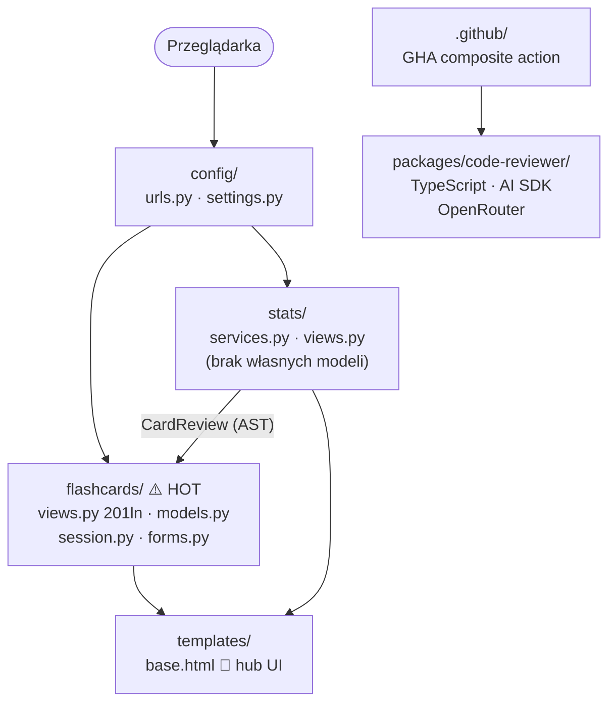

# Mapa Repozytorium — naukaAI

> Wygenerowano: 2026-06-25. Synteza z trzech artefaktów — szczegóły w `artifact-1/2/3-*.md`.  
> Okno: 2 miesiące (2026-05 – 2026-06). Jedyny kontrybutor: Pawelooo.

---

## TL;DR

**naukaAI** to webowa aplikacja do nauki fiszek AI/ML (Django 6.0, Python ≥ 3.14). Składa się z dwóch Django apps: `flashcards` (domena — karty, tematy, sesje nauki) i `stats` (analityka — tylko czyta z `flashcards`), plus osobnej paczki TypeScript `packages/code-reviewer` (agent AI do review PR-ów, osobny stack). Projekt ma 2 miesiące historii i jest w fazie aktywnego budowania — 53 commity, intensywność rośnie (33 commitów w czerwcu vs 20 w maju). Cała logika domenowa żyje w jednym pliku: `flashcards/views.py` (201 linii, 15 commitów) — to zarówno centrum systemu, jak i główny punkt bólu. Jedyne cross-app sprzężenie w Pythonie to `stats/services.py → flashcards.models.CardReview`; zmiana schematu `CardReview` ma ukryty blast radius w `stats` bez sygnału typecheckera.

---

## Teren

### Centrum vs peryferia

| Obszar | Commity (12 mies.) | Głębokość | Rola |
|--------|-------------------|-----------|------|
| `flashcards/views.py` | 15 | głęboki | God View — cała logika biznesowa |
| `flashcards/tests.py` | 13 | głęboki | 52 testy integracyjne, rośnie razem z views |
| `flashcards/` (cała app) | 45 | — | centrum projektu |
| `stats/` | 17 | płytki | analityka, brak własnych modeli |
| `templates/base.html` | 5 | płytki | hub UI, zmienia się przy każdej nawigacyjnej feature |
| `packages/code-reviewer/` | 18 | głęboki | osobny stack TS, aktywny od czerwca |
| `config/` | 8 | płytki | routing + ustawienia |
| `flashcards/migrations/` | 5 | generowane | zmiana przez `makemigrations`, nie ręcznie ✱ |

✱ *Migracje zmieniają się przez regenerację — tańszy rodzaj sprzężenia. Zmiana w `models.py` automatycznie pociąga nową migrację, ale koszt edycji jest po stronie modelu, nie migracji.*

### Aktywność w czasie

Projekt startował 2026-05-26. Dwa miesiące to za mało na trend długoterminowy — cały obraz to faza bootstrappu.

---

## Realne powiązania

### Co naprawdę zmienia się razem (git — co-change)

- **`flashcards/views.py` + `flashcards/tests.py`** — zmieniają się w każdej feature (19/21 commitów `flashcards` dotyczy obu). Źródło: historia gita.
- **`templates/base.html`** — zmienia się przy każdej zmianie nawigacji (auth flow, theme, navbar link). Źródło: historia gita, 5 commitów cross-cuttingowych.
- **`config/ + flashcards/ + stats/ + templates/`** — duże cross-app commity (2 wystąpienia) przy zmianach routingu i auth redirectów. Źródło: historia gita.

### Sprzężenia strukturalne (AST — graf importów)

- **`stats/services.py` → `flashcards.models.CardReview`** — jedyne cross-app sprzężenie w Pythonie. Zmiana pól `reviewed_at`, `is_correct` lub `user` w `CardReview` łamie `compute_study_stats` i `get_leaderboard` bez błędu typecheckera. Źródło: AST parse.
- **`stats/tests.py` → `flashcards.models`** — testy `stats` importują model bezpośrednio, nie przez serwis. Źródło: AST parse.
- **`config/urls.py`** — zawiera logikę biznesową (`HomeView.dispatch`, `RegisterView.form_valid`); naruszenie granicy warstw. Źródło: AST parse.

### Brak cykli

Graf importów Python to DAG — żadnych cykli. `flashcards` nie importuje z `stats`. Źródło: DFS po AST.

### Czego mapa NIE objęła

- **`packages/code-reviewer/` (TypeScript)** — brak grafu zależności TS/ESM. Dependency-cruiser nie był uruchomiony. To **unknown**, nie „brak powiązań". Wiadomo z historii gita, że `src/agent.ts`, `src/prompts/`, `src/schemas/` zmieniają się razem, ale wewnętrzny graf importów TS nie był analizowany.
- **Szablony Django (`templates/`)** — brak grafu zależności. Zmiany śledzone przez git, nie przez narzędzie strukturalne.

---

## Strefy ryzyka

| # | Strefa | Dlaczego ryzykowna |
|---|--------|--------------------|
| 1 | `flashcards/views.py` | God View: 201 linii, 7 klas, 10 funkcji, 13 importów — każda feature ląduje tutaj; plik rośnie z każdym sprintem |
| 2 | `stats → flashcards.CardReview` | Ukryty blast radius: zmiana schematu `CardReview` psuje `stats` bez sygnału typecheckera ani linting |
| 3 | `flashcards/session.py` | 1 commit, brak własnych testów; kontrakt 5 kluczy sesji (`SK`) współdzielony przez 3 widoki — literówka = cichy `KeyError` w runtime |
| 4 | `config/urls.py` | Logika biznesowa (redirect po login/register) w warstwie konfiguracji — zmiana flow auth wymaga edycji pliku, który "nie powinien" zawierać logiki |
| 5 | `packages/code-reviewer/` (TS) | Osobny stack bez grafu zależności; ESM/CJS interop rozwiązany przez subprocess pattern — nieoczywiste dla kogoś przychodzącego z Django |

---

## Kogo zapytać

Projekt jednosobowy — jedyny kontrybutor to **Pawelooo** (paweloo0147@gmail.com). Brak bus factora > 1.

| Strefa | Pytaj o | Gdzie szukać kontekstu pisanego |
|--------|---------|--------------------------------|
| Sesja Django (SK keys, flow) | Pawelooo | `context/changes/complete-study-session/plan.md` |
| CRUD + permissions (`created_by`) | Pawelooo | `context/changes/crud-gap-analysis/plan.md` |
| `stats` / leaderboard | Pawelooo | `context/changes/leaderboard/plan.md` |
| TypeScript agent + CI/CD | Pawelooo | `context/changes/tool-loop-agent/plan.md`, `context/changes/ci-cd/plan.md` |
| Promptfoo evals | Pawelooo | `context/changes/code-review-evals/plan.md` |

Jeśli Pawelooo jest niedostępny: każda decyzja architektoniczna ma swój `plan.md` w `context/changes/<change-id>/`. To jedyna dokumentacja poza kodem.

---

## Pierwszy dzień — 5–8 plików do przeczytania

Kolejność ma znaczenie — od szerokiego do szczegółowego:

1. **`context/changes/complete-study-session/plan-brief.md`** — 2-pager opisujący core flow aplikacji (topics → session → results). Najlepsze wprowadzenie do domeny.
2. **`flashcards/models.py`** (57 ln) — `Card`, `CardReview`, `Topic`. Cały model domenowy w jednym pliku; czytaj przed `views.py`.
3. **`flashcards/session.py`** (25 ln) — klasa `SK` z 5 kluczami sesji. Bez tego `views.py` jest nieczytelny.
4. **`flashcards/views.py`** (201 ln) — centrum systemu. Czytaj po `models.py` i `session.py`. Zwróć uwagę na `study_card`, `session_start`, `session_results`.
5. **`stats/services.py`** (67 ln) — jedyne cross-app sprzężenie. `compute_study_stats` + `get_leaderboard` opierają się wyłącznie na `CardReview`.
6. **`config/urls.py`** — entry points + logika redirect (HomeView, RegisterView). Mapa tras całej aplikacji.
7. **`packages/code-reviewer/src/agent.ts`** — tylko jeśli pracujesz przy code-reviewerze. Fabryka agenta (`createCodeReviewerAgent`) + singleton CI.

Opcjonalnie: **`flashcards/tests.py`** (579 ln) — 52 testy integracyjne jako living documentation; czytaj po `views.py`.

---

## Ograniczenia

- **Okno czasowe:** 2026-05 – 2026-06 (2 miesiące). Za mało na trend długoterminowy. Cały obraz to bootstrap phase.
- **Metoda territory (artifact-1):** git log — mierzy aktywność edytorską, nie znaczenie domenowe. Plik może być ważny, a mało zmieniany (np. `models.py`).
- **Metoda structure (artifact-2):** AST Python. Nie obejmuje: szablonów Django, TypeScript (`packages/code-reviewer/`), konfiguracji YAML/TOML, zależności runtime (sygnały Django, middleware).
- **Metoda contributors (artifact-3):** git author. `Co-Authored-By: Claude Sonnet` w treści commitów nie oznacza bota jako autora gita — wszystkie commity należą do Pawelooo.
- **Czego mapa NIE mówi:** jakość kodu poza metrykami złożoności, pokrycie testami (procent linii), wydajność zapytań ORM, stan infrastruktury Fly.io.